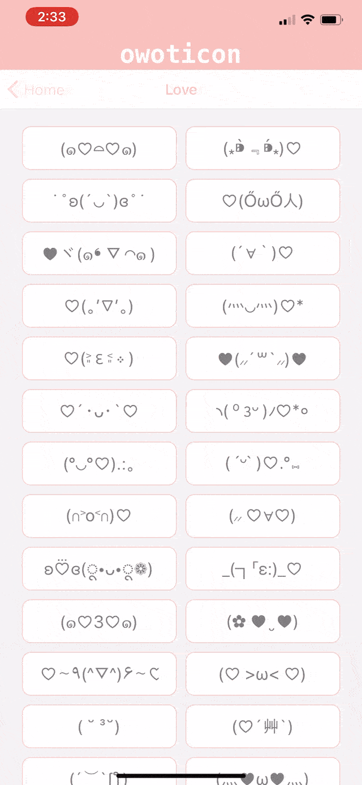
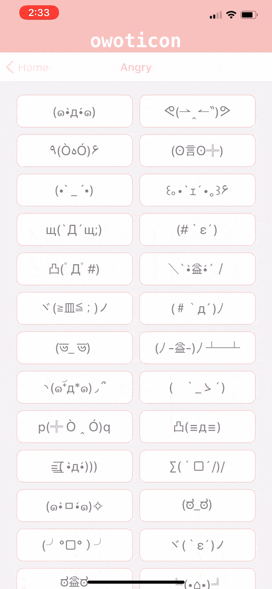
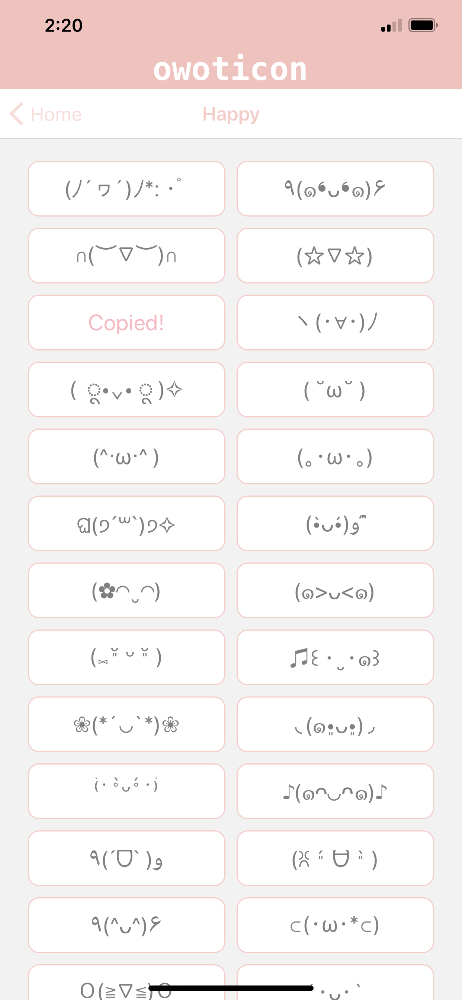
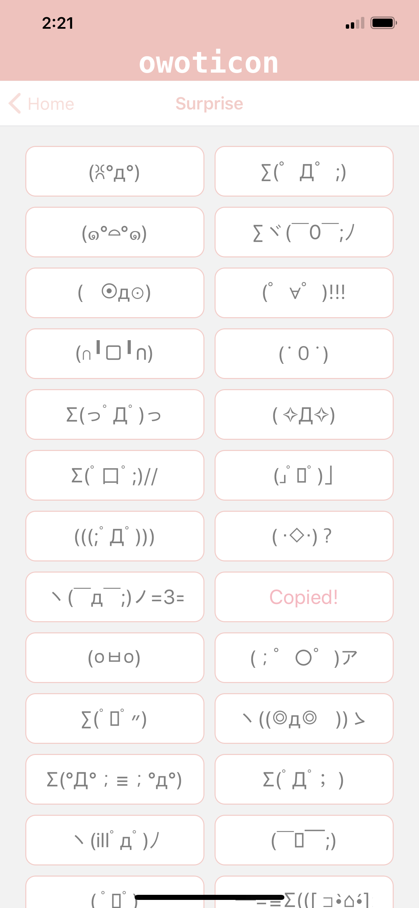

<h1 align="center" size="50px">owoticon (◡‿◡✿)</h1>

 

A simple IOS/Android application where users can quickly find cute emoticon text faces to use in conversations.  

Emoticons are divided into "mood" categories, and tapping a single emoticon saves that selection to the user's clipboard. 

*Built using React Native.*
 

<h2 align="center">Live Demo</h2>

Select a mood category, and either tap to copy an emoticon to your clipboard or hold down the emoticon to open the share panel and send in a message or post directly from the app.

 
 

  
  
  

 
<h2 align="center">Stills</h2>
 

  
  
  
  

 
  

